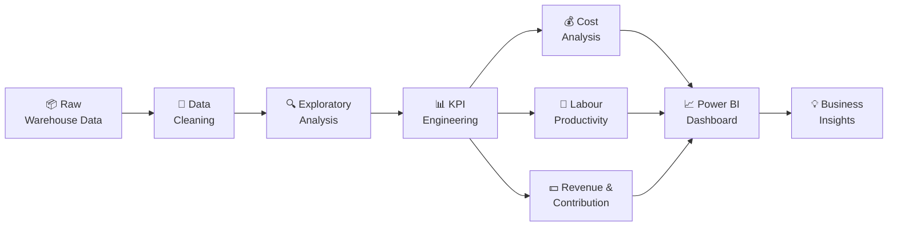

<div align="center">


# 📦 Warehouse Cost & Capacity Analysis by shivani raj


<br>


</div>

---

<div align="center">

## 🚀 PROJECT AT A GLANCE

<table>
<tr>
<td align="center">📦<br><b>Workload</b><br>Orders & Units</td>
<td align="center">💰<br><b>Cost</b><br>Operating Cost</td>
<td align="center">👷<br><b>Productivity</b><br>Labour Efficiency</td>
<td align="center">📈<br><b>Commercial</b><br>Revenue & Contribution</td>
</tr>
</table>

</div>

---

# 👩‍💻 Meet the Analyst


### Hi, I'm **Shivani Raj** 👋

I'm an aspiring **Data Analyst** interested in using data to solve real-world business problems.

My analytical toolkit includes:

🐍 Python
🗄️ SQL
📊 Excel
📈 Power BI
🤖 Machine Learning

I enjoy transforming:

**Raw Data → Analysis → KPIs → Insights → Business Decisions**

<br clear="right"/>

---

# 🎯 Business Objective

> **Convert warehouse operational data into actionable KPIs for capacity planning, cost analysis, productivity measurement and operational decision-making.**

This project uses **simulated warehouse order-level data** to analyze the relationship between:

```text
              📦 WORKLOAD
                  │
                  ▼
             👷 LABOUR
                  │
                  ▼
             ⏱️ TIME
                  │
                  ▼
             💰 COST
                  │
                  ▼
           📊 PRODUCTIVITY
                  │
                  ▼
          💵 COMMERCIAL VALUE
                  │
                  ▼
         🎯 BUSINESS DECISIONS
```

---

# 🔥 Key Questions

<div align="center">

|  📦 Operations |   💰 Cost   |  👷 Productivity | 💵 Commercial |
| :------------: | :---------: | :--------------: | :-----------: |
|  Total Orders? | Total Cost? |   Labour Hours?  |    Revenue?   |
|  Total Units?  | Cost/Order? |    Units/Hour?   | Contribution? |
| Zone Workload? |  Cost/Unit? | Zone Efficiency? |   Margin %?   |

</div>

---

# 📊 KPI ENGINE

### 💰 Cost per Order

```text
                 Total Operating Cost
Cost / Order = ───────────────────────
                    Total Orders
```

### 📦 Cost per Unit

```text
                 Total Operating Cost
Cost / Unit = ─────────────────────────
                    Total Units
```

### 💵 Contribution

```text
Contribution = Revenue − Operating Cost
```

### 📈 Contribution Margin

```text
                         Contribution
Contribution Margin = ──────────────── × 100
                           Revenue
```

### 👷 Labour Productivity

```text
                    Total Units
Units / Labour Hr = ─────────────
                    Labour Hours
```

---

# 🛠️ TECH STACK

<div align="center">


<br><br>


</div>

---

# 🔄 DATA ANALYTICS PIPELINE



---

# 🗂️ PROJECT ARCHITECTURE

```text
📦 Warehouse-Cost-Capacity-Analysis
│
├── 📁 data
│   └── 📄 warehouse_orders.csv
│
├── 📁 excel
│   └── 📊 cost_model.xlsx
│
├── 📁 python
│   └── 🐍 warehouse_analysis.py
│
├── 📁 sql
│   └── 🗄️ business_queries.sql
│
├── 📁 powerbi
│   └── 📈 dashboard_setup.md
│
├── 📁 screenshots
│   ├── 📊 workload.png
│   ├── 💰 cost_analysis.png
│   └── 📈 dashboard.png
│
└── 📄 README.md
```

---

# 🧹 STEP 01 — DATA PREPARATION

The simulated order-level dataset is prepared for analysis through:

```text
Raw Data
   ↓
Missing Value Check
   ↓
Duplicate Check
   ↓
Data Type Validation
   ↓
Outlier / Consistency Checks
   ↓
Feature Preparation
   ↓
Analysis Ready Dataset
```

---

# 🔍 STEP 02 — EXPLORATORY DATA ANALYSIS

Using **Python, Pandas, NumPy, Matplotlib and Seaborn**, the analysis explores:

📦 Order volume
📦 Unit volume
🏷️ Product categories
🏭 Warehouse zones
👷 Labour hours
💰 Operating cost
💵 Revenue
📈 Contribution

The objective is to identify patterns that can support operational and commercial analysis.

---

# 💰 STEP 03 — COST ANALYSIS

Warehouse operating costs are analyzed through two major categories:

### 🏢 Fixed / Allocated Costs

Costs that generally remain relatively stable within a relevant operating range.

Examples:

* Facility-related costs
* Allocated overhead
* Fixed operational expenses

### ⚙️ Variable Costs

Costs that change with operational activity.

Examples:

* Labour
* Handling
* Order-related operating costs

```text
FIXED COST
     +
VARIABLE COST
     ↓
OPERATING COST
     ↓
COST / ORDER
     ↓
COST / UNIT
```

---

# 👷 STEP 04 — PRODUCTIVITY ANALYSIS

Labour productivity is analyzed using:

### `Units per Labour Hour`

```text
              Units Processed
Productivity = ───────────────
               Labour Hours
```

The metric can be compared across warehouse zones to understand differences in workload handling and labour utilization.

---

# 📦 STEP 05 — CAPACITY ANALYSIS

Capacity analysis connects:

```text
Orders
  +
Units
  +
Labour Hours
  +
Handling Time
       ↓
Workload Requirement
       ↓
Capacity Planning
       ↓
Manpower Planning
```

This provides a framework for understanding how operational workload can translate into resource requirements.

---

# 💵 STEP 06 — COMMERCIAL ANALYSIS

Operational analysis is connected with commercial metrics:

```text
             REVENUE
                │
                ▼
        ┌───────────────┐
        │    OPERATING  │
        │      COST     │
        └───────┬───────┘
                │
                ▼
          CONTRIBUTION
                │
                ▼
       CONTRIBUTION MARGIN
```

This helps connect **warehouse operations with business performance**.

---

# 📊 POWER BI DASHBOARD

The dashboard is designed around four major analytical areas:

<div align="center">

### 📦 WORKLOAD

**Orders • Units • Zone Volume**

⬇️

### 💰 COST

**Operating Cost • Cost/Order • Cost/Unit**

⬇️

### 👷 PRODUCTIVITY

**Labour Hours • Units/Labour Hour**

⬇️

### 💵 COMMERCIAL

**Revenue • Contribution • Margin %**

</div>

---

# 🧠 BUSINESS INSIGHT FRAMEWORK

```text
                     DATA
                      │
          ┌───────────┼───────────┐
          ▼           ▼           ▼
       WORKLOAD      COST     PRODUCTIVITY
          │           │           │
          └───────────┼───────────┘
                      ▼
                CAPACITY
                  PLANNING
                      │
                      ▼
              COMMERCIAL
               ANALYSIS
                      │
                      ▼
             BUSINESS INSIGHTS
```

---

# 🎤 INTERVIEW READY

### ❓ Why did you build this project?

> I wanted to create a practical analytics project where operational data could be connected to cost, productivity, capacity and commercial metrics. Instead of focusing only on visualization, I wanted to understand how warehouse KPIs can support operational decision-making.

### ❓ Why Cost per Order?

> Cost per order measures the average operating cost associated with processing an order. It provides a useful normalized view when comparing operational performance.

### ❓ Why Cost per Unit?

> Cost per unit normalizes operating cost against the number of units processed, which helps understand cost relative to physical workload.

### ❓ How did you measure productivity?

> I used Units per Labour Hour, calculated by dividing total processed units by total labour hours, and compared the metric across warehouse zones.

### ❓ How can this support manpower planning?

> Workload and labour-hour patterns can help estimate the labour requirement associated with different activity levels. In a real environment, historical productivity and handling-time data could be used to build more detailed workforce planning models.

### ❓ What are the limitations?

> The dataset is simulated and therefore the results should not be interpreted as actual warehouse performance. Cost allocations, labour assumptions and operational relationships are simplified for portfolio purposes.

---

# 🚀 FUTURE ENHANCEMENTS


Possible future extensions:

* 📅 Demand forecasting
* 👷 Workforce requirement prediction
* 📦 Capacity utilization modeling
* 💰 Scenario-based cost simulation
* 🤖 ML-based workload forecasting
* 🔔 Automated KPI alerts
* 📊 What-if analysis
* 🔄 Automated dashboard refresh

---

# ⚠️ DATA DISCLAIMER

> **All operational data used in this project is simulated for educational and portfolio purposes. It does not represent Edgistify or any real client's data.**

---

# 👩‍💻 SHIVANI RAJ

<div align="center">


<br><br>

<a href="mailto:shivaniraj4976@gmail.com">

</a>

<a href="YOUR_LINKEDIN_URL">

</a>

<a href="YOUR_GITHUB_URL">

</a>

<br><br>

⭐ **Star this repository if you found it useful!**

</div>

---

<div align="center">


### 📊 DATA → INSIGHTS → DECISIONS

**Built with Python • SQL • Excel • Power BI**

</div>
